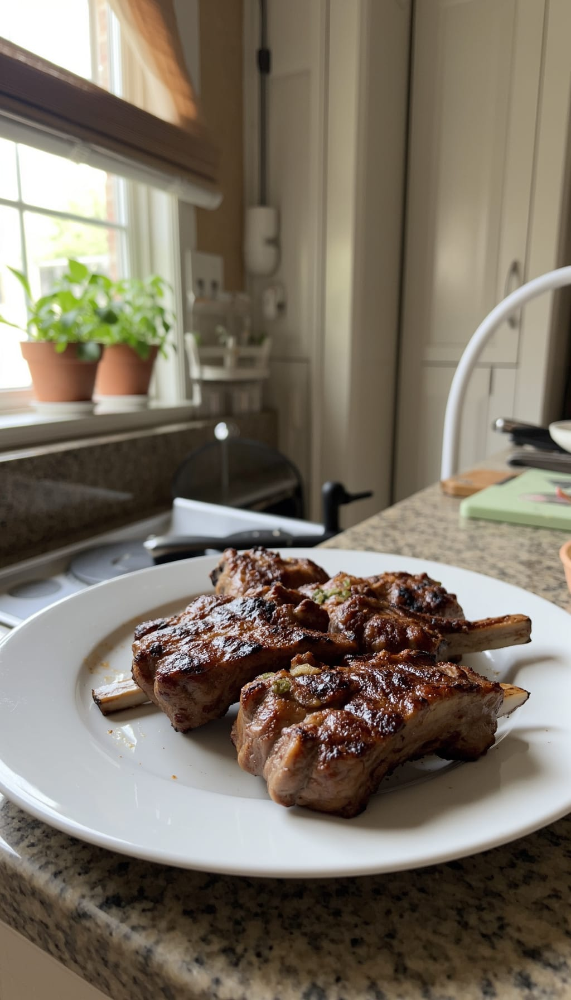
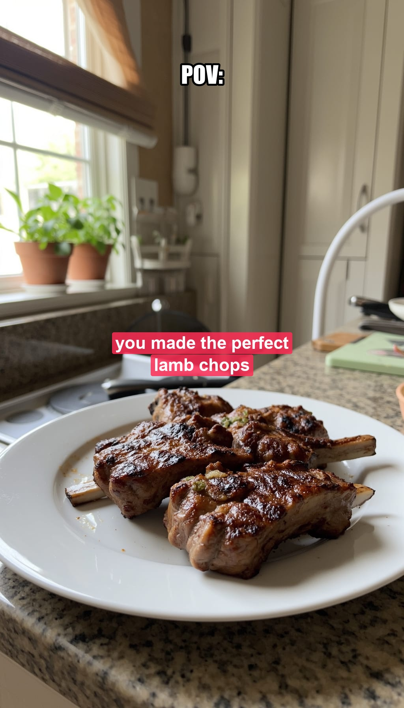
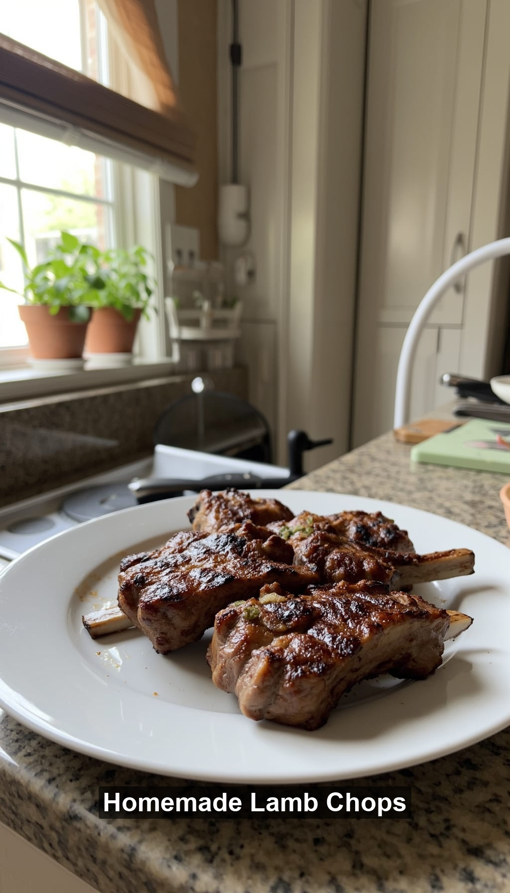
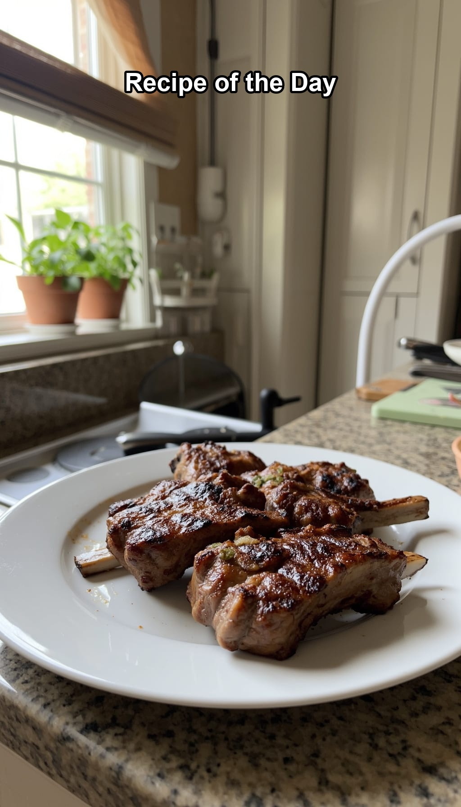
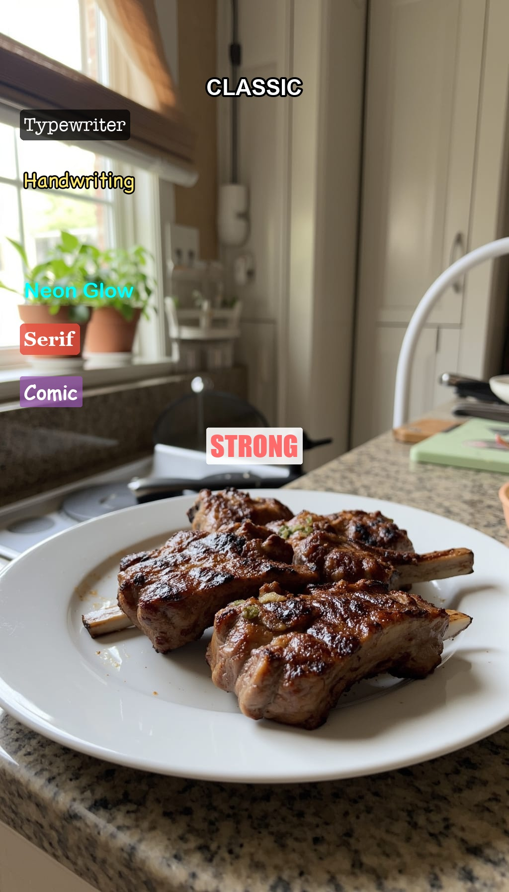

# TikTok Text Overlay

Add TikTok-style text overlays to images and videos with Python. Supports 7 font styles, 4 background modes, stroke outlines, timed video text, and fade animations.

No API needed — just import and call.

## Image: Before & After

<table>
<tr>
<th>Before</th>
<th>After</th>
</tr>
<tr>
<td></td>
<td></td>
</tr>
</table>

### More Styles

<table>
<tr>
<th>Highlight</th>
<th>Stroke Outline</th>
<th>Full Background</th>
</tr>
<tr>
<td></td>
<td></td>
<td></td>
</tr>
</table>

<table>
<tr>
<th>All Styles</th>
<th>TikTok POV Style</th>
</tr>
<tr>
<td></td>
<td></td>
</tr>
</table>

## Video: Before & After

<table>
<tr>
<th>Before</th>
<th>After</th>
</tr>
<tr>
<td>
<video src="examples/video_before.mp4" width="300" controls></video>
</td>
<td>
<video src="examples/video_after.mp4" width="300" controls></video>
</td>
</tr>
</table>

*Video supports timed text with fade in/out — texts appear and disappear at specified timestamps.*

## Install

```bash
pip install Pillow moviepy
```

Pillow is required. moviepy is only needed for video overlays.

## Quick Start

### Image

```python
from tiktok_overlay import overlay_text, TikTokStyle

# Highlight style (TikTok default)
overlay_text("photo.jpg", "Hello TikTok!", "output.jpg")

# Outlined text (dark boundary)
overlay_text("photo.jpg", "Bold Caption", "output.jpg",
    style=TikTokStyle.CLASSIC,
    font_size=52,
    bg_style="none",
    stroke_width=5,
    stroke_color="#000000",
)
```

### Multiple Texts on One Image

```python
from tiktok_overlay import overlay_texts, TextOverlay, TikTokStyle

overlay_texts("photo.jpg", [
    TextOverlay("POV:", position="top", style=TikTokStyle.STRONG,
                font_size=60, stroke_width=5, bg_style="none"),
    TextOverlay("you nailed the recipe", position="center",
                style=TikTokStyle.CLASSIC, bg_style="highlight",
                bg_color="#FF2D55", bg_opacity=0.85),
], "output.jpg")
```

### Video

```python
from tiktok_video_overlay import overlay_video_text, overlay_video_texts, VideoTextOverlay
from tiktok_overlay import TikTokStyle

# Simple — text on entire video
overlay_video_text("input.mp4", "Hello!", "output.mp4",
    style=TikTokStyle.CLASSIC, font_size=52, stroke_width=5)

# Timed texts with fade
overlay_video_texts("input.mp4", [
    VideoTextOverlay("Appears 0-3s", t_start=0, t_end=3,
        fade_in=0.5, fade_out=0.5,
        style=TikTokStyle.CLASSIC, position="top",
        font_size=48, stroke_width=4),
    VideoTextOverlay("Appears 2-5s", t_start=2, t_end=5,
        style=TikTokStyle.STRONG, position="center",
        font_size=56, text_color="#FF6B6B", stroke_width=5),
    VideoTextOverlay("Always visible",
        style=TikTokStyle.CLASSIC, position="bottom",
        font_size=40, bg_style="highlight"),
], "output.mp4")
```

### CLI

```bash
# Image
python tiktok_overlay.py input.jpg "Your text" output.jpg classic

# Video
python tiktok_video_overlay.py input.mp4 "Your text" output.mp4 strong
```

## Styles

| Style | Value | Look |
|-------|-------|------|
| Classic | `classic` | Clean bold sans-serif |
| Typewriter | `typewriter` | Monospace typewriter |
| Handwriting | `handwriting` | Casual handwriting |
| Neon | `neon` | Rounded bold with glow |
| Serif | `serif` | Traditional serif |
| Strong | `strong` | Extra bold impact |
| Comic | `comic` | Playful comic sans |

## Background Modes

| Mode | Value | Description |
|------|-------|-------------|
| None | `none` | Text only, no background |
| Highlight | `highlight` | Per-line rounded highlight (TikTok default) |
| Full BG | `full_bg` | Single box behind all text |
| Letter | `letter` | Tight per-line highlight |

## Parameters

| Parameter | Type | Default | Description |
|-----------|------|---------|-------------|
| `text` | str | — | Text to overlay |
| `style` | TikTokStyle | `classic` | Font style |
| `font_size` | int | `48` | Font size in pixels |
| `text_color` | str | `#FFFFFF` | Text color (hex) |
| `bg_style` | str | `highlight` | Background mode |
| `bg_color` | str | `#000000` | Background color (hex) |
| `bg_opacity` | float | `0.6` | Background opacity (0-1) |
| `position` | str / tuple | `center` | `top`, `center`, `bottom`, or `(x, y)` |
| `alignment` | str | `center` | `left`, `center`, `right` |
| `stroke_width` | int | `0` | Outline thickness (use 4-6 for TikTok look) |
| `stroke_color` | str | `#000000` | Outline color (hex) |
| `max_width_ratio` | float | `0.85` | Max text width as ratio of image width |

### Video-Only Parameters

| Parameter | Type | Default | Description |
|-----------|------|---------|-------------|
| `t_start` | float / None | `None` | Start time in seconds (None = beginning) |
| `t_end` | float / None | `None` | End time in seconds (None = end) |
| `fade_in` | float | `0.0` | Fade in duration (seconds) |
| `fade_out` | float | `0.0` | Fade out duration (seconds) |

## Tips

- For the classic TikTok outlined text: `bg_style="none"` + `stroke_width=5`
- For the TikTok highlight look: `bg_style="highlight"` + `bg_opacity=0.6`
- Word wrapping is automatic based on `max_width_ratio`
- Uses macOS system fonts as TikTok-style substitutes — works out of the box on macOS

## Project Structure

```
tiktok_overlay/
├── tiktok_overlay.py         # Image overlay engine
├── tiktok_video_overlay.py   # Video overlay engine
├── SKILL.md                  # OpenClaw skill definition
├── examples/                 # Demo output images
└── test/                     # Test assets
```

## License

MIT
