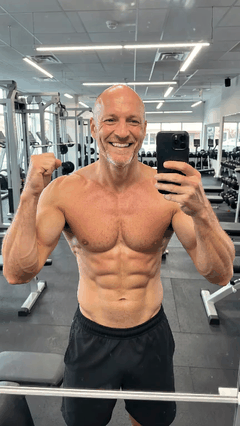
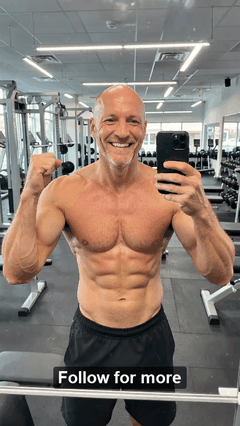

# TikTok Text Overlay

Add TikTok-style text overlays to images and videos with Python. Supports 7 font styles, 4 background modes, stroke outlines, timed video text, and fade animations.

No API needed — just import and call. Accepts flexible input formats for every parameter.

## Image: Before & After

<table>
<tr>
<th>Before</th>
<th>After</th>
</tr>
<tr>
<td></td>
<td></td>
</tr>
</table>

### More Styles

<table>
<tr>
<th>Highlight</th>
<th>Stroke Outline</th>
<th>Full Background</th>
</tr>
<tr>
<td></td>
<td></td>
<td></td>
</tr>
</table>

<table>
<tr>
<th>All Styles</th>
<th>TikTok POV Style</th>
</tr>
<tr>
<td></td>
<td></td>
</tr>
</table>

## Video: Before & After

<table>
<tr>
<th>Before</th>
<th>After</th>
</tr>
<tr>
<td></td>
<td></td>
</tr>
</table>

*Video supports timed text with fade in/out — texts appear and disappear at specified timestamps.*

## Install

### OpenClaw Skill

```bash
clawhub install tiktok-overlay
```

### Manual

```bash
git clone https://github.com/xmuweili/tiktok-overlay.git
cd tiktok-overlay
pip install Pillow moviepy
```

Pillow is required. moviepy is only needed for video overlays.

## Quick Start

### Image

```python
from tiktok_overlay import overlay_text

# Highlight style (TikTok default)
overlay_text("photo.jpg", "Hello TikTok!", "output.jpg")

# Outlined text (dark boundary)
overlay_text("photo.jpg", "Bold Caption", "output.jpg",
    style="classic", font_size=52, bg_style="none", stroke_width=5)

# Return PIL Image instead of saving
img = overlay_text("photo.jpg", "Hello!", font_size="large")
```

### Multiple Texts

```python
from tiktok_overlay import overlay_texts, TextOverlay

# Using TextOverlay objects
overlay_texts("photo.jpg", [
    TextOverlay("POV:", position="top", style="strong",
                font_size=60, stroke_width=5, bg_style="none"),
    TextOverlay("you nailed it", position="center",
                bg_style="highlight", bg_color="#FF2D55", bg_opacity="85%"),
], "output.jpg")

# Using dicts
overlay_texts("photo.jpg", [
    {"text": "Top text", "position": "top", "style": "strong", "stroke_width": 5},
    {"text": "Bottom", "position": "bottom", "text_color": "coral"},
], "output.jpg")

# Using (text, kwargs) tuples
overlay_texts("photo.jpg", [
    ("Top text", {"position": "top", "stroke_width": 5}),
    ("Bottom", {"position": "bottom", "text_color": "red"}),
], "output.jpg")
```

### Video

```python
from tiktok_video_overlay import overlay_video_text, overlay_video_texts, VideoTextOverlay

# Simple — text on entire video
overlay_video_text("input.mp4", "Hello!", "output.mp4",
    style="classic", font_size=52, stroke_width=5)

# Timed texts with fade
overlay_video_texts("input.mp4", [
    VideoTextOverlay("Appears 0-3s", t_start=0, t_end=3,
        fade_in=0.5, fade_out=0.5,
        style="classic", position="top", font_size=48, stroke_width=4),
    VideoTextOverlay("Appears 2-5s", t_start=2, t_end=5,
        style="strong", position="center",
        font_size=56, text_color="tomato", stroke_width=5),
    VideoTextOverlay("Always visible",
        position="bottom", font_size=40, bg_style="highlight"),
], "output.mp4")
```

### CLI

```bash
# Image (output path is optional — defaults to input_overlay.ext)
python tiktok_overlay.py input.jpg "Your text" output.jpg classic

# Video
python tiktok_video_overlay.py input.mp4 "Your text" output.mp4 strong
```

## Flexible Inputs

Every parameter accepts multiple formats — use whatever is most convenient.

### Input Source

```python
# File path
overlay_text("photo.jpg", "Hello", "output.jpg")

# PIL Image
from PIL import Image
img = Image.open("photo.jpg")
overlay_text(img, "Hello", "output.jpg")

# Numpy array
import numpy as np
arr = np.array(Image.open("photo.jpg"))
overlay_text(arr, "Hello", "output.jpg")

# Bytes
with open("photo.jpg", "rb") as f:
    overlay_text(f.read(), "Hello", "output.jpg")
```

### Output

```python
# Save to file
overlay_text("photo.jpg", "Hello", "output.jpg")

# Return PIL Image (omit output_path or pass None)
result = overlay_text("photo.jpg", "Hello")
result.show()
```

### Colors

```python
# Hex (full, short, with alpha)
text_color="#FF0000"
text_color="#F00"
text_color="#FF000080"    # with alpha

# Named colors (all PIL/CSS named colors)
text_color="red"
text_color="coral"
text_color="dodgerblue"

# RGB / RGBA tuples
text_color=(255, 0, 0)
text_color=(255, 0, 0, 128)
```

### Font Size

```python
# Pixels (int or string)
font_size=48
font_size="48px"

# Named sizes
font_size="xs"        # 24px
font_size="small"     # 32px
font_size="medium"    # 48px (default)
font_size="large"     # 64px
font_size="xl"        # 80px
font_size="xxl"       # 96px
font_size="title"     # 72px
font_size="subtitle"  # 40px
font_size="caption"   # 28px
```

### Style

```python
# String
style="classic"
style="strong"

# Enum
from tiktok_overlay import TikTokStyle
style=TikTokStyle.CLASSIC

# None (defaults to classic)
style=None
```

### Position

```python
# Named positions
position="top"
position="center"
position="bottom"
position="top-left"
position="top-right"
position="bottom-left"
position="bottom-right"

# Pixel coordinates
position=(100, 200)

# Percentage of image size
position=("50%", "80%")

# Dict with mixed values
position={"x": "10%", "y": "top"}
position={"x": 100, "y": "50%"}
```

### Opacity

```python
# Float 0.0-1.0
bg_opacity=0.6

# Int 0-255
bg_opacity=153

# Percentage string
bg_opacity="60%"
```

### Max Width Ratio

```python
# Float
max_width_ratio=0.85

# Percentage string
max_width_ratio="85%"
```

### Overlay List Formats

```python
from tiktok_overlay import overlay_texts, TextOverlay

overlay_texts("photo.jpg", [
    # TextOverlay object
    TextOverlay("Hello", position="top", style="strong"),

    # Dict
    {"text": "World", "position": "center", "text_color": "red"},

    # (text, kwargs) tuple
    ("Bottom", {"position": "bottom", "font_size": "large"}),
], "output.jpg")
```

## Styles

| Style | Value | Look |
|-------|-------|------|
| Classic | `classic` | Clean bold sans-serif |
| Typewriter | `typewriter` | Monospace typewriter |
| Handwriting | `handwriting` | Casual handwriting |
| Neon | `neon` | Rounded bold with glow |
| Serif | `serif` | Traditional serif |
| Strong | `strong` | Extra bold impact |
| Comic | `comic` | Playful comic sans |

## Background Modes

| Mode | Value | Description |
|------|-------|-------------|
| None | `none` | Text only, no background |
| Highlight | `highlight` | Per-line rounded highlight (TikTok default) |
| Full BG | `full_bg` | Single box behind all text |
| Letter | `letter` | Tight per-line highlight |

## Parameters

| Parameter | Accepts | Default | Description |
|-----------|---------|---------|-------------|
| `input_source` | path, PIL Image, numpy array, bytes | — | Image to overlay |
| `text` | str | — | Text to overlay |
| `output_path` | path or None | None | Save path; None returns PIL Image |
| `style` | str, TikTokStyle, None | `classic` | Font style |
| `font_size` | int, str (`"48px"`, `"large"`) | `48` | Font size |
| `text_color` | hex, named, rgb/rgba tuple | `#FFFFFF` | Text color |
| `bg_style` | str | `highlight` | Background mode |
| `bg_color` | hex, named, rgb/rgba tuple | `#000000` | Background color |
| `bg_opacity` | float 0-1, int 0-255, str `"60%"` | `0.6` | Background opacity |
| `position` | str, (x,y), ("x%","y%"), dict | `center` | Text position |
| `alignment` | str | `center` | `left`, `center`, `right` |
| `stroke_width` | int | `0` | Outline thickness (4-6 for TikTok look) |
| `stroke_color` | hex, named, rgb/rgba tuple | `#000000` | Outline color |
| `max_width_ratio` | float or str `"85%"` | `0.85` | Max text width ratio |

### Video-Only Parameters

| Parameter | Type | Default | Description |
|-----------|------|---------|-------------|
| `t_start` | float / None | `None` | Start time in seconds (None = beginning) |
| `t_end` | float / None | `None` | End time in seconds (None = end) |
| `fade_in` | float | `0.0` | Fade in duration (seconds) |
| `fade_out` | float | `0.0` | Fade out duration (seconds) |

## Tips

- For the classic TikTok outlined text: `bg_style="none"` + `stroke_width=5`
- For the TikTok highlight look: `bg_style="highlight"` + `bg_opacity=0.6`
- Word wrapping is automatic based on `max_width_ratio`
- Uses macOS system fonts as TikTok-style substitutes — works out of the box on macOS

## Project Structure

```
tiktok_overlay/
├── tiktok_overlay.py         # Image overlay engine
├── tiktok_video_overlay.py   # Video overlay engine
├── SKILL.md                  # OpenClaw skill definition
├── examples/                 # Demo output images
└── test/                     # Test assets
```

## License

MIT
